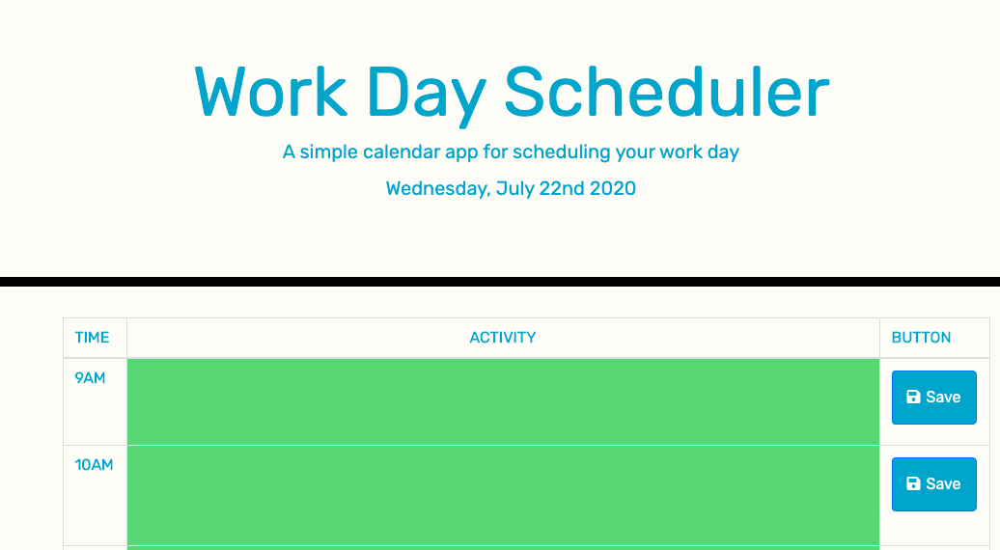

# Day-Planner

## Description

This is a simple work day planner. This planner is based on a 9-5 workday. Languages used are HTML, CSS, Bootstrap, Jquery

## Table of Contents

* [Description](#description)
* [User Story](#user-story)
* [Installation](#installation)
* [Usage](#usage)
* [License](#license)
* [Contributing](#contributing)
* [Tests](#tests)
* [Questions](#questions)
* [Deployed Application URL](#deployed-application-URL)

## User Story

AS AN employee with a busy schedule
I WANT to add important events to a daily planner
SO THAT I can manage my time effectively

## Installation

No installation needed.

## Usage

The deployed application link will take you to the homepage. 

- On each hour you can type in your acitivity under the activity column. Hit the save button to save the text in local storage. When the page is refreshed or the browser is closed, the saved text will still be displayed. To clear the texts, there is a clear all text button below the table.

- The color of the rows will change throughout the day, depending on the hour. The activity row will be highlighted in red on the current hour. The hours that past will be hightlighted in gray and the future hours will be highlighted in green.

## License

## Contributing

Please follow standard contributing guidelines.

## Tests

No tests to run.

## Questions

For any questions, please contact kendayao at kendayao@gmail.com

## Deployed Application URL

Deployed application link: https://rocky-ravine-58747.herokuapp.com/

